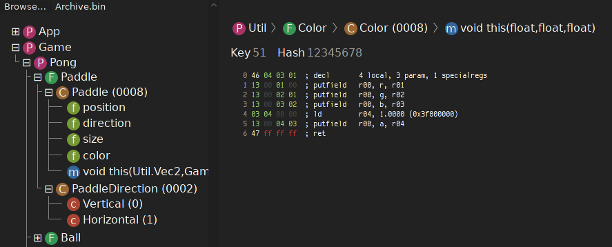

**Mint Explorer** is a tool for exploring archive/package files for the Mint
scripting engine, found in various video games, notably games from the Kirby
series.  It parses an input file (containing packages, files, classes, methods,
fields and constants) into a tree and disassembles methods when selected in
the tree view.

Mint Explorer is written based on reverse-engineering work performed by
observing several instances of bytecode files in order to deduce the structure
(and meaning of the bytecode) in them.

Bytecode files are sometimes compressed.  In this case, they currently need to
be decompressed before being loaded into Mint Explorer.

## Screenshot

## License
Undecided as of yet, will probably go for MIT license.  If you have any
interest in using any of this code, feel free to contact me and I'll most
likely be happy to slap a license on it.

